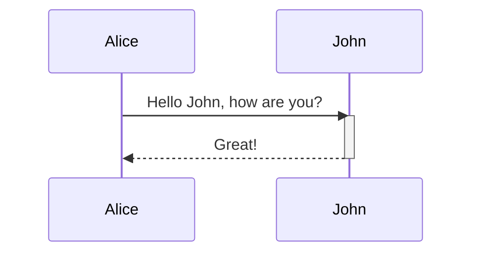
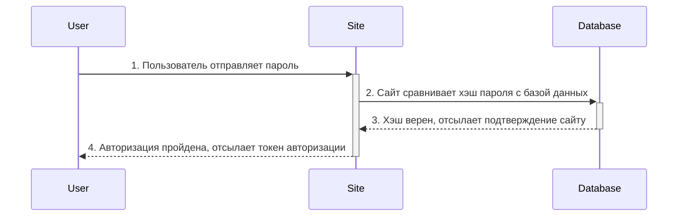
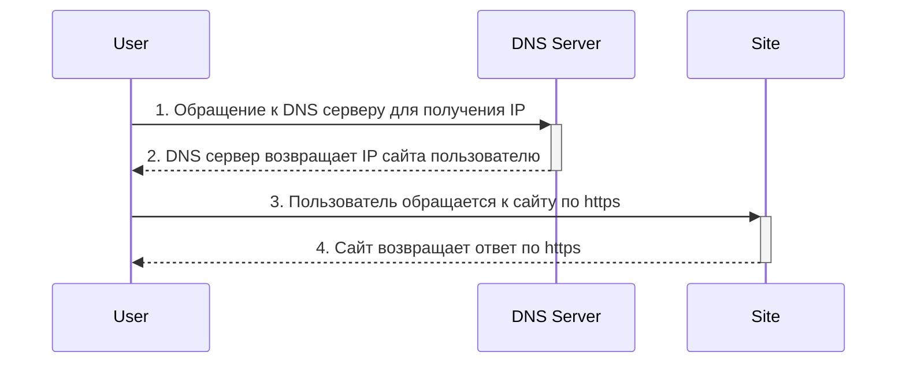

### Теоретический материал
**sequence-диаграмма** (Диаграмма последовательности) - в основном используется для визуализации взаимодействия объектов системы между друг другом.

**Диаграмма** состоит из:
- **Объектов** (в данном примере Alice и John)
- **Линии жизни** (lifeline) - вертикальные линии исходящие от объектов с ==блоками активности== (прямоугольниками на вертикальных линиях). Эти линии отображают течение времени, активность или исполнение определённых функций объекта.
- **Сообщения** (messages) - показывают обмен информацией между объектами (стрелочки). Обычно представляют собой запрос или ответ либо вызов какой-либо процедуры.

==Узнать о более детальных обозначениях можно с помощью [[#Полезные ссылки]]==

#### Примеры

##### Пример 1
Авторизация на сайте

##### Пример 2
Обращение к сайту

### Полезные ссылки
https://practicum.yandex.ru/blog/sequence-diagram/

https://habr.com/ru/articles/814769/

https://mermaid.js.org/syntax/sequenceDiagram.html